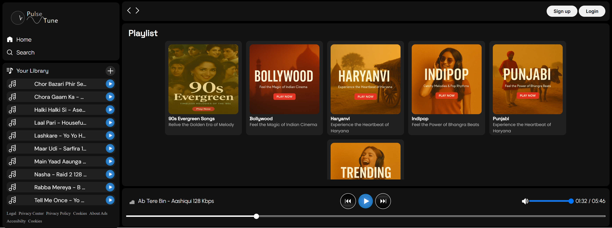
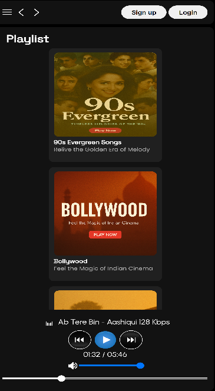

# PulseTune - Web Music Player
PulseTune is a modern, responsive web-based music player that lets you feel the pulse of your music. It features a sleek dark theme interface with playlist management, audio controls, and a responsive design that works across different devices.
## Screenshot
  Here's what the PulseTune application looks like on different devices:
### Desktop View

### Mobile View

## Features
- 🎵 Multiple playlist support
- 🎨 Dark theme interface
- 📱 Responsive design
- 🎚️ Volume control with mute option
- ⏭️ Next/Previous track navigation
- 🎼 Real-time progress bar
- 📑 Library management
## Technology Stack
- HTML5
- CSS3
- JavaScript (Vanilla)
## Installation
1. Clone the repository: git clone https://github.com/Ankittkr/PulseTune-Web-Player.git
2. Navigate to the project directory: Project PluseTune
3. Open `index.html` in your browser or serve it through a local server.
## Usage
1. **Playing Music**
   - Click on any playlist to view its songs
   - Click on a song to start playing
   - Use the playbar controls for play/pause, next/previous, and volume control
2. **Managing Playlists**
   - Navigate through different playlists from the library section
   - Each playlist shows a cover image and description
   - Click on playlist cards to view and play songs
3. **Audio Controls**
   - Use the progress bar to seek through the current track
   - Adjust volume using the volume slider
   - Toggle mute with the volume icon
   - Navigate tracks using previous/next buttons
## Project Structure
    PulseTune/
        ├── img/                 # Image assets
        ├── songs/              # Music files and playlist information
        │   ├── Trending/
        │   ├── Bollywood/
        │   └── ...
        ├── index.html         # Main HTML file
        ├── style.css         # Main styles
        ├── utility.css       # Utility classes
        └── scripts.js       # JavaScript functionality
## Contributing
1. Fork the repository
2. Create your feature branch (`git checkout -b feature/AmazingFeature`)
3. Commit your changes (`git commit -m 'Add some AmazingFeature'`)
4. Push to the branch (`git push origin feature/AmazingFeature`)
5. Open a Pull Request
## Acknowledgments
- Font families from Google Fonts
- Icons and SVG assets from various open-source projects 
